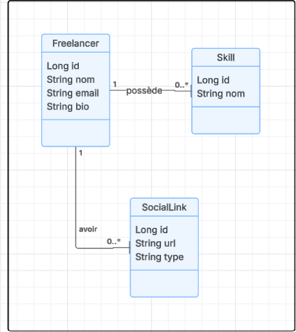

# 💼 Freelance Platform - GraphQL API

Une plateforme destinée aux freelances permettant de gérer leurs profils, compétences et liens professionnels via une API GraphQL.

---

## 🎯 Objectifs


Permettre à une startup de gérer les profils des freelances (création, mise à jour, suppression) avec :
- Données personnelles (nom, email, bio)
- Compétences (skills)
- Liens sociaux (GitHub, LinkedIn...)
- Exposer ces opérations via une API GraphQL.


---


## 📋 Liste des fonctionnalités (Web services)

| Fonctionnalité                     | Type de service (CRUD)  |
|-----------------------------------|--------------------------|
| Créer un profil utilisateur       | Create                   |
| Modifier un profil utilisateur    | Update                   |
| Supprimer un profil utilisateur   | Delete                   |
| Consulter un profil utilisateur   | Read                     |
| Ajouter une compétence            | Create                   |
| Modifier / Supprimer compétence   | Update / Delete          |
| Ajouter un lien professionnel     | Create                   |
| Supprimer un lien professionnel   | Delete                   |

---

## ⚙️ Technologies utilisées

- Spring Boot
- GraphQL (spring-boot-starter-graphql)
- Spring Data JPA
- MySQL
- Lombok
- Java 17

---


## 🧱 Entités

### ✅ Freelancer
- `id`: ID
- `nom`: String
- `email`: String
- `bio`: String
- `skills`: Liste de compétences
- `links`: Liste de liens sociaux

### ✅ Skill
- `id`: ID
- `nom`: String
- `freelancer`: Référence au freelance

### ✅ SocialLink
- `id`: ID
- `url`: String
- `type`: String
- `freelancer`: Référence au freelance

---


## 📚  C’est quoi GraphQL ?
GraphQL est un langage de requête pour les API. Il te permet de demander exactement les données
 Contrairement à REST, où tu dois souvent faire plusieurs appels à différentes routes (/freelancer, /skills, etc.).


## 🔧 Structure GraphQL
Les deux types d'opérations en GraphQL :
1. 🔍 Query – Lire des données (GET en REST)
Elle sert à récupérer des données depuis le serveur.
2. ✍️ Mutation – Modifier des données (POST, PUT, DELETE en REST)
Sert à créer, mettre à jour, ou supprimer des données.

## 🎯 Exemple Comparatif : REST vs GraphQL
####🔸 En REST :
```http

GET /freelancers
GET /freelancers/1
GET /freelancers/1/skills
```
####🔹 En GraphQL :
```graphql

query {
  freelancer(id: 1) {
    nom
    skills {
      nom
    }
  }
}
```

### 📥 Queries

```graphql
type Query {
  freelancers: [Freelancer]
  freelancer(id: ID!): Freelancer
  skills: [Skill]
  socialLinks: [SocialLink]
}


```
###  ✏️ Mutations
```graphql
type Mutation {
  createFreelancer(nom: String!, email: String!, bio: String): Freelancer
  deleteFreelancer(id: ID!): Boolean
  updateFreelancer(id: ID!, nom: String, email: String, bio: String): Freelancer

  addSkill(freelancerId: ID!, nom: String!): Skill
  updateSkill(freelancerId: ID!, skillId: ID!, nom: String!): Skill
  deleteSkill(freelancerId: ID!, skillId: ID!): Boolean

  addSocialLink(freelancerId: ID!, url: String!, type: String!): SocialLink
  updateSocialLink(freelancerId: ID!, socialLinkId: ID!, url: String!, type: String!): SocialLink
  deleteSocialLink(freelancerId: ID!, socialLinkId: ID!): Boolean
}
```

## 📚 Exemples d’utilisation
## 🔍 Consulter tous les freelances

```graphql
query {
  freelancers {
    id
    nom
    email
  }
}
```
## 🔍 Consulter un freelance par ID

```graphql
query {
  freelancer(id: 1) {
    nom
    bio
    skills {
      nom
    }
    links {
      url
      type
    }
  }
}

```
## ➕ Créer un freelance
```graphql
mutation {
  createFreelancer(nom: "chayma", email: "chayma@gmail.com", bio: "Développeur fullstack") {
    id
    nom
  }
}

```

## ✏️ Modifier un freelance
```graphql
mutation {
  updateFreelancer(id: 1, nom: "chayma Modifié", bio: "Expert Java") {
    id
    nom
    bio
  }
}

```
## ➖ Supprimer un freelance
```graphql
mutation {
  deleteFreelancer(id: 1)
}

```

## ➕ Ajouter une compétence
```graphql


mutation {
  addSkill(freelancerId: 1, nom: "Spring Boot") {
    id
    nom
  }
}

```
## ➕ Ajouter un lien social
```graphql
mutation {
  addSocialLink(freelancerId: 1, url: "https://github.com/tarek", type: "GitHub") {
    id
    url
    type
  }
}
```


## 🧭 Schéma des requêtes et réponses GraphQL
## 🔍 Query : Obtenir tous les freelancers
```graphql
query {
  freelancers {
    id
    nom
    email
    bio
    skills {
      id
      nom
    }
    links {
      id
      url
      type
    }
  }
}
```
## 📤 Réponse :
```graphql

{
  "data": {
    "freelancers": [
      {
        "id": "1",
        "nom": "chayma",
        "email": "chayma@gmail.com",
        "bio": "Full-stack developer",
        "skills": [
          { "id": "1", "nom": "Java" }
        ],
        "links": [
          { "id": "1", "url": "https://github.com/chayma", "type": "GitHub" }
        ]
      }
    ]
  }
}

```
## 🔍 Query : Obtenir un freelancer par ID


```graphql
query {
  freelancer(id: 1) {
    nom
    email
    bio
  }
}
```
## ✏️ Mutation : Créer un freelancer
```graphql
mutation {
  createFreelancer(nom: "chayma", email: "chayma@gmail.com", bio: "Freelancer in DevOps") {
    id
    nom
  }
}
```
## ✏️ Mutation : Ajouter une compétence
```graphql
mutation {
  addSkill(freelancerId: 1, nom: "ReactJS") {
    id
    nom
  }
}

```
## ✏️ Mutation : Ajouter un lien social

```graphql
mutation {
  addSocialLink(freelancerId: 1, url: "https://linkedin.com/in/chayma", type: "LinkedIn") {
    id
    type
    url
  }
}
```
## ✏️ Mutation : Mettre à jour un freelancer
```graphql
mutation {
  updateFreelancer(id: 1, nom: "chayma ouni", email: "chayma11@newmail.com", bio: "Updated bio") {
    id
    nom
  }
}

```


# 🧑‍💻 Auteur

Projet réalisé par chayma ouni 
Dans le cadre du module Web Services
 Génie Logiciel A